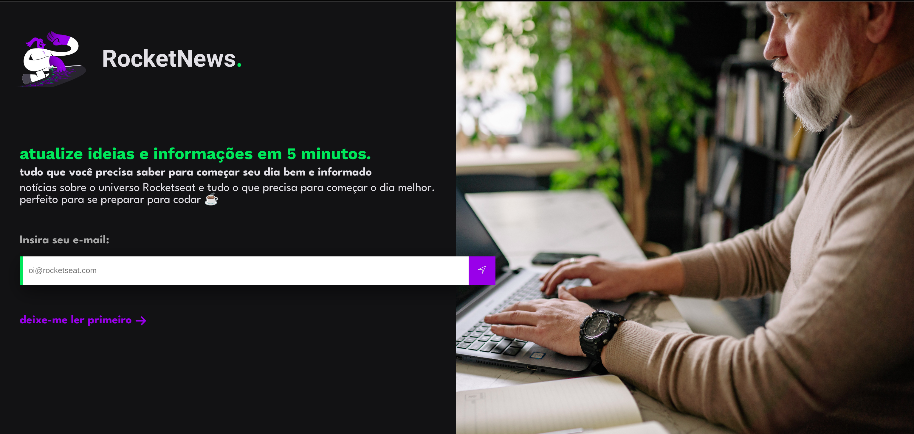

  <a href="#-tecnologias">Tecnologias</a>&nbsp;&nbsp;&nbsp;|&nbsp;&nbsp;&nbsp;
  <a href="#-projeto">Projeto</a>&nbsp;&nbsp;&nbsp;|&nbsp;&nbsp;&nbsp;
  <a href="#-layout">Layout</a>

 

 

  

## 🚀 Tecnologias

Esse projeto foi desenvolvido com as seguintes tecnologias:

- HTML
- CSS

Bibliotecas

- [Google Fonts](https://fonts.google.com/)

## 💻 Projeto

Desafio criado pela Rocketseat para desenvolver uma página simples para captação de leads ou newsletter.

➡️ [Acesso ao projeto](https://mariamorena27.github.io/rocketNews/)

---

## 🔖 Layout

Você pode visualizar o layout do projeto através [desse link](https://www.figma.com/file/7EXfDHd8CY0GXPhLQ4Y4YP/DD-RocketNews-Copy?fuid=1097722096024065435). É necessário ter conta no [Figma](https://figma.com) para acessá-lo.

---

Feito com ♥ by Maria Morena!
